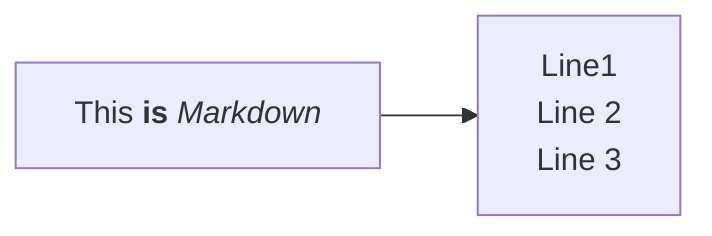
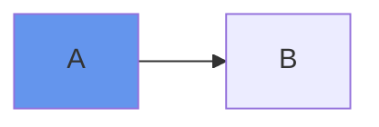

# Meu primeiro markdown

primeiro paragrafo 

segundo paragrafo

e por ai vai...

## Formas de texto

*Itálico*

**Negrito** 

~~Tachado~~

==Realçado==


## Lista desordenada
- Item 1
- Item 2
- Item 3

## Lista ordenada

1. Item 1
2. Item 2
3. Item 3

## Links

[Este link vai para o Google](google.com)

[Este link vai para imgur](https://imgur.com/)


## Código

```python
print("Olá Mundo!!!")
```

# Tabela

| $\Delta$ x (m) | F (N) |
|--------------|-------|
| 1            | 2     |
| 2            | 4     |
| 3            | 6     |
| 4            | 8     |
| 5            | 10    |

| Tables   |      Are      |  Cool |
|----------|:-------------:|------:|
| col 1 is |  left-aligned | $1600 |
| col 2 is |    centered   |   $12 |
| col 3 is | right-aligned |    $1 |

## Emoji

:snake:
:smile:
:heart:
:smiley:

## Mermaid





